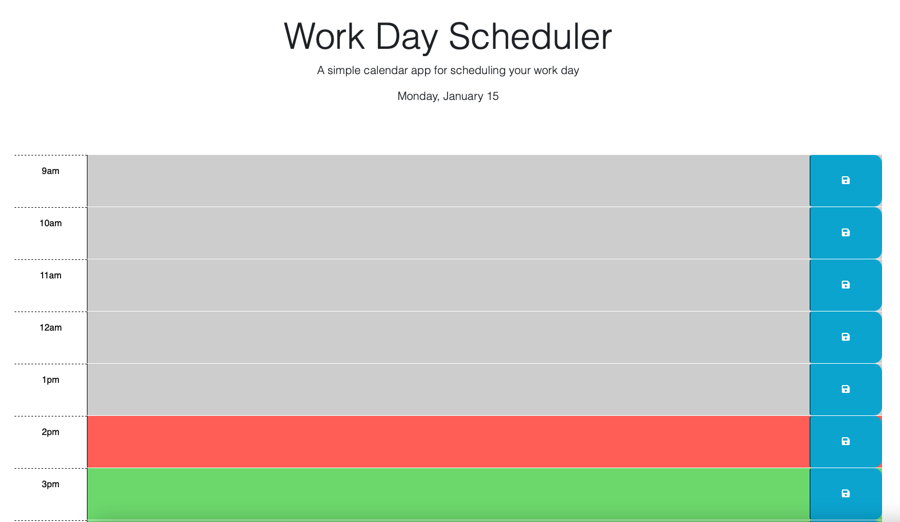

#Calendar App

## Description

Calendar App is designed to serve as a scheduler for work between the hours of 9am to close at 5pm. Here you can enter your tasks for each hour of the day and it will be stored even if you refresh the page. 

In this version, I have dynamically generated the containers for each hour and added event listeners to track clicks on save buttons where the content of that hour is saved in local storage. 

Live Link:
https://zaczacariah.github.io/calendarApp/

## Screenshot

## Installation

N/A

## Usage

For use by anyone seeking a task tracker for their work schedule.

## Credits
 N/A

## License

Please refer to the LICENSE in the repo.
 
